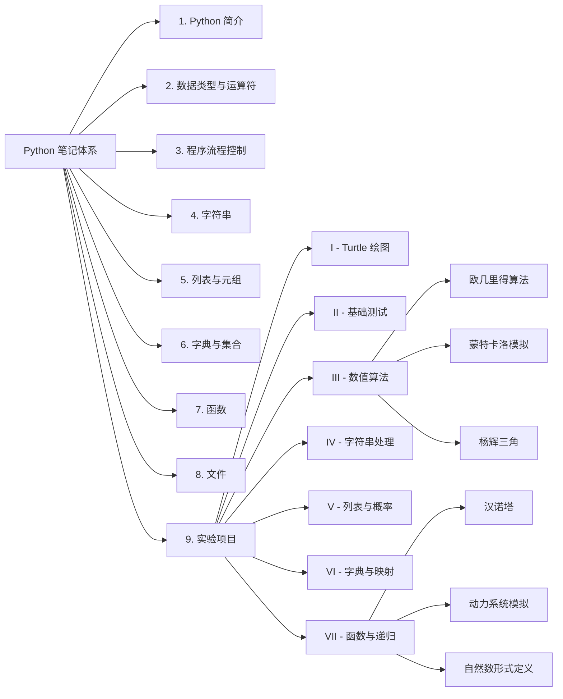

---
tags:
  - Python
  - 算法
  - 数学编程
  - 学习路线
  - 导航
  - 实验
---

> **说明**:本页是 Python 课程笔记的**总导航(MOC)**,将所有章节按学习路径串联,并明确各章与数学,算法的关联.同时整合了完整的实验项目索引,使理论学习与代码实践形成闭环.适合已具备基础编程概念,正在自学微积分/线性代数/离散数学,并准备向算法和科学计算方向深入的读者.

---

#### 推荐教材(辅助参考)

- **《Python编程:从入门到实践》** – Eric Matthes 著  
  适合快速上手,项目导向,涵盖基础语法与实战.

- **《程序设计导论:Python语言实践》** – Robert Sedgewick 等  
  更侧重计算机科学基础与算法思维,与数学结合紧密.

> 建议以课程笔记为主,教材作为补充查阅.

---

#### 学习路径概览

本笔记按 **“语法基础 → 数据结构 → 程序逻辑 → 文件与综合应用 → 实验实践”** 的递进顺序组织,同时在每个模块中穿插数学与算法视角.

| 章节                              | 核心内容                     | 数学/算法关联                      |
| :------------------------------ | :----------------------- | :--------------------------- |
| **[1. Python 简介](Python简介.md)** | 硬件基础,语言历史,特性,环境搭建        | 建立计算思维,为算法设计铺垫               |
| **[2. 数据类型与运算符](数据类型与运算符.md)**  | 数值,字符串,变量,输入/输出,`math` 库 | 微积分/线性代数中的基本运算(四则,幂,开方,三角函数) |
| **[3. 程序流程控制](程序流程控制.md)**      | 分支,循环,异常处理               | 算法中的选择与迭代结构,逻辑推理(离散数学)       |
| **[4. 字符串](字符串.md)**            | 索引,切片,内置方法,格式化           | 文本处理基础,为自然语言处理打底             |
| **[5. 列表与元组](列表与元组.md)**        | 序列操作,列表生成式,元组            | 向量/矩阵表示(线性代数),数据聚合           |
| **[6. 字典与集合](字典与集合.md)**        | 键值映射,集合运算                | 映射关系(函数),集合论,去重与关系测试         |
| **[7. 函数](函数.md)**              | 定义,参数,作用域,递归,`lambda`    | 模块化设计,递归(数学归纳法),高阶函数         |
| **[8. 文件](文件.md)**              | 读写文本/CSV,`with` 语句       | 数据持久化,CSV 与表格数据(统计/数据分析)     |
| **[9. 实验项目](实验项目索引.md)**        | 全课程实验代码汇总与实践             | 理论知识的代码落地,算法验证与数学可视化         |

---

#### 实验模块导览

本课程配套实验代码按功能模块组织为 7 个文件夹,每个文件夹配有独立的 MOC(内容地图),可通过下方链接快速访问:

| 目录 | 主题 | 核心知识点 | 跳转 |
| :--- | :--- | :--- | :--- |
| **I** | Turtle 图形绘制 | 循环,随机,递归,极坐标 | [[I - Turtle绘图实验]] |
| **II** | 基础语法测试 | 变量,输入输出,内置函数 | [[II - 基础测试实验]] |
| **III** | 数值算法与模拟 | 数论,蒙特卡洛,随机数生成 | [[III - 数值算法与模拟实验]] |
| **IV** | 字符串与随机生成 | 切片,编码,凯撒密码,随机构造 | [[IV - 字符串与随机生成实验]] |
| **V** | 列表与马尔可夫链 | 列表遍历,矩阵迭代,概率模拟 | [[V - 列表与马尔可夫链实验]] |
| **VI** | 字典与映射 | 键值对,逆映射,词频统计 | [[VI - 字典与映射实验]] |
| **VII** | 函数与递归进阶 | 分治,递归,动力系统,模块化 | [[VII - 函数与递归进阶实验]] |

> 实验模块顶层入口:[[实验项目索引]]

---

#### 如何使用本导航

1. **按顺序学习**:每个章节均建立在前面内容之上,建议逐章攻克.
2. **结合数学实践**:每学完一节,尝试用 Python 解决对应的数学问题(例如:学完循环后,用级数计算 π;学完列表后,用矩阵乘法模拟线性变换).
3. **理论联系实验**:学完相关章节后,及时完成对应的实验代码,将理论知识落地为可运行的实践项目.
4. **反复回顾**:在后续算法学习中(如递归,排序,搜索),可回到对应章节重温基础语法.
5. **动手编码**:所有示例代码均可在本地环境中运行,鼓励修改参数观察变化.

---

#### 扩展学习方向

完成基础八章及配套实验后,可转向以下专题:
- **NumPy/SciPy** – 数值计算与线性代数
- **SymPy** – 符号数学
- **Matplotlib** – 数据可视化
- **算法与数据结构** – 排序,搜索,图论,动态规划
- **机器学习入门** – 线性回归,分类,聚类

---

#### 知识图谱总览

