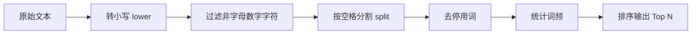

# `词频分析程序(集合版).py` · 文本词频分析

> **摘要**：这是一个完整的文本词频统计程序，包含数据清洗、去停用词、词频统计和 Top N 排序输出。是**自然语言处理**（NLP）中文本预处理与统计的微型示例。

---

#### 💻 代码

```python
t = str(input())
N_top = int(input())

# 转小写
t = t.lower()

# 收集所有非字母数字字符
s1 = set(t)
s2 = set()
for i in s1:
    if not (i.isdigit() or i.islower()):
        s2.add(i)

# 替换非字母数字字符为空格
for i in s2:
    t = t.replace(i, ' ')

# 分割单词，去除停用词
s3 = set(t.split()) - {'the', 'and', 'to', 'of', 'a', 'be'}

# 统计词频并排序
l2 = [[t.count(i), i] for i in s3]
l2.sort(reverse=True)
l2 = l2[:N_top]

# 输出
for i in l2:
    print('{:<20}{:>5}'.format(i[1], i[0]))
print('HALT')
```

---

#### 📖 运行示例

**输入**：
```
I have a dream that one day every valley shall be exalted.
5
```

**输出**（示例）：
```
day                  1
dream                1
every                1
exalted              1
have                 1
HALT
```

---

#### 📐 数据清洗流程



##### 停用词列表
`{'the', 'and', 'to', 'of', 'a', 'be'}`

这些是最常见的无意义词语，去除后可减少噪音，聚焦于有实际意义的词汇。

##### 输出格式
```
{词:<20}{频率:>5}
```

---

#### 🔗 关联笔记
- [[字典及字典操作#综合应用示例]]
- [[集合与集合操作#综合应用示例]]
- [[字符串#内置的字符串处理方法]]
- [[列表与列表操作#列表排序]]

#### 🔗 返回上级
- [[VI - 字典与映射实验]]
