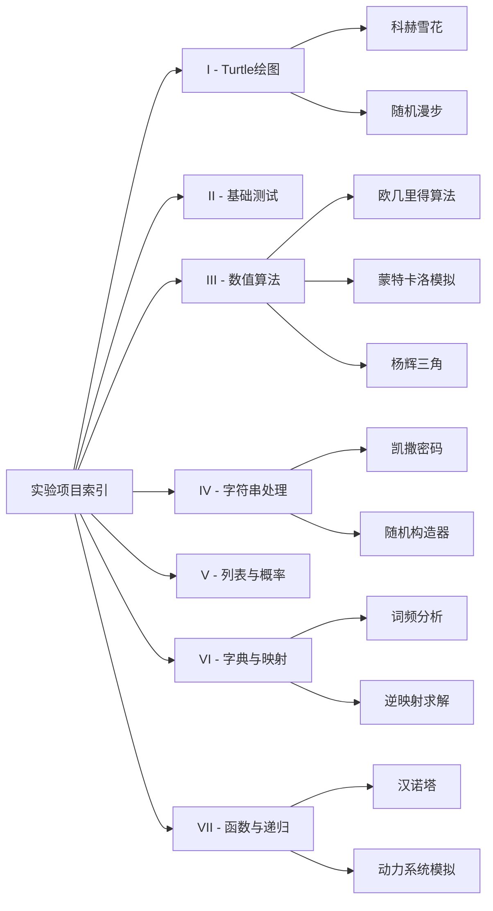

---
tags:
  - 实验项目
  - 索引
  - 导航
  - 算法实践
  - 代码库
aliases:
  - 代码实验汇总
---

# 🧪 Python 实验项目索引

> **说明**：本页是所有 Python 实验代码的顶层导航。所有代码按功能模块组织在 7 个文件夹中，每个文件夹均配有独立的 MOC（内容地图）。这些实验涵盖了从 Turtle 绘图、数值算法、字符串处理到递归分形的完整知识图谱。

---

#### 📂 文件夹导航

| 目录 | 主题 | 核心知识点 | 跳转 |
| :--- | :--- | :--- | :--- |
| **I** | Turtle 图形绘制 | 循环、随机、递归、极坐标 | [[I - Turtle绘图实验]] |
| **II** | 基础语法测试 | 变量、输入输出、基础运算 | [[II - 基础测试实验]] |
| **III** | 数值算法与模拟 | 数论、蒙特卡洛、随机数生成 | [[III - 数值算法与模拟实验]] |
| **IV** | 字符串与随机生成 | 切片、编码、凯撒密码、随机构造 | [[IV - 字符串与随机生成实验]] |
| **V** | 列表与马尔可夫链 | 列表遍历、矩阵迭代、概率模拟 | [[V - 列表与马尔可夫链实验]] |
| **VI** | 字典与映射 | 键值对、逆映射、词频统计 | [[VI - 字典与映射实验]] |
| **VII** | 函数与递归进阶 | 分治、递归、动力系统、模块化 | [[VII - 函数与递归进阶实验]] |

---

#### 🗺️ 知识图谱总览

---

#### 🔗 关联理论笔记
- [[程序流程控制]] — 循环与分支的基础
- [[random库的使用]] — 随机数生成
- [[字符串]] — 文本处理
- [[列表与元组]] — 数据容器
- [[字典与集合]] — 映射与关系
- [[函数]] — 模块化与递归
